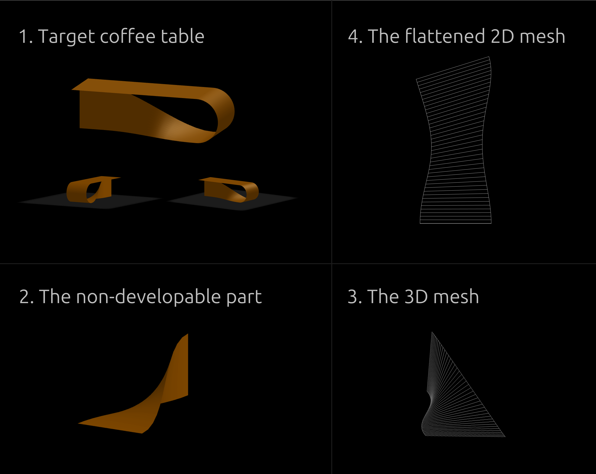

## Introduction

A Python application that calculates the two-dimensional developed surface of circular wooden frustums and generates CNC-ready `.fmc` files for legacy IMA routers running IMAWOP 2.6.

## Project Showcase

[](https://www.youtube.com/watch?v=um9QZ45gd-Q)

## The Client Project

The application was developed for a real manufacturing workflow in which the coordinates required to produce wooden frustums had to be calculated and entered manually into IMAWOP.

From user-defined dimensions, it automatically:

- Calculates the frustum’s two-dimensional developed surface.
- Determines the boundary and kerf-cut coordinates.
- Generates a CNC-ready `.fmc` file for IMAWOP 2.6.

This replaces hours of manual calculations and coordinate entry with an automatically generated machine file in a fraction of a second.

## Elliptical Frustum Extension

After completing the client project, I extended the mathematical approach to elliptical wooden frustums. This is a proprietary implementation.

The extension calculates the unrolled geometry from the ellipse axes and height, then generates an AutoCAD-compatible `.scr` script containing the boundary paths and kerf-cut coordinates.

Unlike the original application, this extension is not tied to IMAWOP or a specific CNC machine. Its AutoCAD-ready output can be incorporated into general CAD/CAM and CNC workflows.

Below is the demo of this extension.

[](https://www.youtube.com/watch?v=9bOSvsbDzCo)

## Non Developable Surfaces - Meshing

Another proprietary project is the coffee table shown below. Its surface is not developable, so I used meshing to approximate it. It is a ruled surface, so the same approach can be extended to other ruled surfaces, given the curves that define them.

At this stage, the approach is intended for thin sheet metal fabrication, since it models the surface without accounting for material thickness. I plan, (not so) soon, to implement a version that accounts for material thickness for wooden construction.



## Technologies

- Python
- SciPy
- NumPy
- Streamlit
- Plotly
- Mathematical and geometric modelling
- IMAWOP 2.6 `.fmc` file generation
- AutoCAD scripting

## Running the Project

Clone the repository and enter its directory:

```bash
git clone https://github.com/Raynover/Frustify.git
cd Frustify
```

Create and activate a virtual environment:

```bash
python3 -m venv .venv
source .venv/bin/activate
```

Install the dependencies and run the application:

```bash
pip install -r requirements.txt
streamlit run app.py
```

The application should open automatically in your default browser. If it does not, visit:

```text
http://localhost:8501
```
